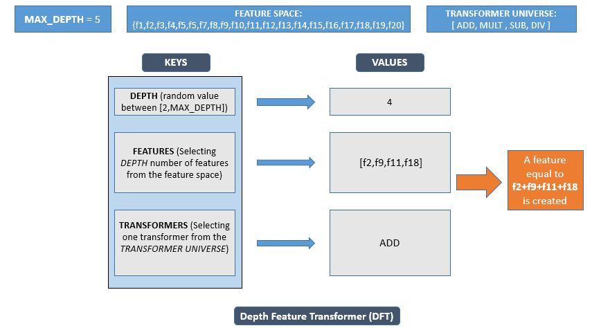
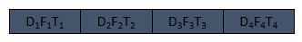
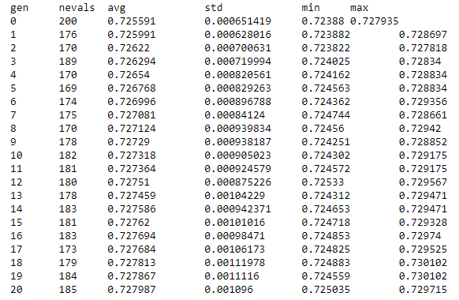

### <font color=black> <font size = 5>Topics to Cover:</font>
<font color=blue> <font size = 3>
> 1. **Getting Ready (Transformer Universe)**
> 2. **Settinup up GA functions:**
    - <font color=green> <font size = 3> **Individual Generating Function** </font></font>
    - <font color=green> <font size = 3> **Crossover Function** </font></font>
    - <font color=green> <font size = 3> **Mutation Function** </font></font>
    - <font color=green> <font size = 3> **Selection Function** </font></font>
    - <font color=green> <font size = 3> **Evaluation Function** </font></font>
> 3. **Setting up the Toolbox**
> 4. **Running the GA**
> 4. **Some ideas to explore**    
</font>


```python
import numpy as np
import pandas as pd
from deap import creator, base, tools, algorithms
from lightgbm import LGBMClassifier
from sklearn.metrics import roc_auc_score
from sklearn.model_selection import StratifiedKFold
from sklearn.preprocessing import LabelEncoder
import random
import warnings
warnings.filterwarnings("ignore")
import copy
```

### <font color=green> <font size=6>1. Getting Ready </font>


```python
df=pd.read_csv('data.csv')
```


```python
cat_cols= df.columns[df.dtypes=='object']
id_col=['ID']
target_col=['target']
use_cols=df.columns[~df.columns.isin(id_col+target_col)]
```


```python
### frequency encoding the cateogircal data
def freq_transformer(val):
        return val.map(val.value_counts(1).to_dict())    
df[cat_cols]=np.column_stack([freq_transformer(df[x]) for x in cat_cols])
```


```python
df.fillna(-1,inplace=True)
```


```python
train=df[use_cols]
y=df[target_col]
```


```python
folds=StratifiedKFold(n_splits=5,shuffle=True,random_state=100)
model=LGBMClassifier(num_leaves=16,learning_rate=0.1,subsample=0.684,colsample_bytree=0.701,random_state=100,
                     metrics='None',min_child_weight=21)
```

<font color=blue> <font size = 4> **Once you have the datasaet ready, how do you create features?**</font></font>

<font color=blue> <font size = 4> **At the most basic level what we try and do is select a few columns and apply a set of transformation on it. These transformation can be as simple as an additive transformer to something as complex as a SVD transfomer**</font></font>

<font color=blue> <font size = 4> **This is what we will try to do and build our individuals in a similar manner. For this let's first describe our transfomer universe. We will include the following transformers in our exercise:**</font></font>

### <font color=green> <font size=6>Transformer Universe</font>


```python
## additive transformer
def add_transformer(col_list):
    return train[col_list].sum(axis=1)

## multiplicative transformer
def mult_transformer(col_list):
    return train[col_list].product(axis=1)

## ratio transformer
def div_transformer(col_list):
    num=random.sample(col_list,random.randint(1,len(col_list)-1))
    den=list(set(col_list)-set(num))
    return train[num].product(axis=1)/ (train[den].product(axis=1)+0.000001)    

## delta transfomers
def sub_transformer(col_list):
    pos=random.sample(col_list,random.randint(1,len(col_list)-1))
    neg=list(set(col_list)-set(pos))
    return train[pos].sum(axis=1)- train[neg].sum(axis=1) 

```

<font color=green> <font size = 4> **Please note that all the transformer we have included in our transformer universe is applicable to numerical features only and we have freq encoded all the num var and we are assuming them to be numerical**</font></font>

<font color=green> <font size = 4> **To deal with cateogrical interactions or a mix type interaction (cat+num), you need to define such transformers on your own**</font></font>

<font color=green> <font size = 4> **A full fledged transformer universe will consist of different categories of transformers, for example: num_transformers(examples are above), cat_transformer and mix_transformers**</font></font>

### <font color=green> <font size=6>2. Setting up the Toolbox</font>

### <font color=red> <font size=5>Individual Generating Function</font>

<font color=purple> <font size = 3> It's pretty clear we cannot use the standard list as an individual here. Can a dictionary work in this case?Let's see</font></font>

<font color=purple> <font size = 3> **We define a dict containing two keys:**</font></font>

- <font color=purple> <font size = 3> **First controlling the features part of the feature creation i.e. what all features are involved in creating one feature**</font></font>

- <font color=purple> <font size = 3> **Second will control thr tranformer bit i.e. what transformation needs to be applied to the feature set**</font></font>

<font color=purple> <font size = 3> **For our future reference we will call this dict as a FEATURE TRANSFORMER PAIR (FT)**</font></font>

<font color=green> <font size = 3> **Features part of the FT will be selected randomly but what will govern the number of features to be selected?**</font></font>

<font color=green> <font size = 3> **For this we will declare another controlling paramter i.e. MAX_DEPTH, this will control the max level of interaction we will have in our features**</font></font>

<font color=green> <font size = 3> **We will randomly generate a number between [2,MAX_DEPTH] and this number will be the number of features to be selected for the feature and we will call this as the DEPTH of FT**</font></font>


<font color=black> <font size = 4> **One DFT which basically represents one feature, if you evaluate one DFT you get one feature**</font></font>

<font color=maroon> <font size = 5> **We define an individual to be a list of DFT (we can have a single DFT as an individual, but to simplify things we consider a list, we will see later why single DFT is complicated)**</font></font>

<font color=green> <font size = 4> **STEPS TO BUILD DFT:**</font></font>
- <font color=purple> <font size = 3.5> **Initialize depth(D) between [2,MAX_DEPTH]**</font></font>
- <font color=purple> <font size = 3.5> **Select D features, this is your F**</font></font>
- <font color=purple> <font size = 3.5> **Select a transformer to apply, this is your T**</font></font>

<font color=green> <font size = 4.5> **This is how the DFT is built:**</font></font>


<font color=green> <font size = 4.5> **An indiviidual looks like this:**</font></font>


<font color=green> <font size = 4.5> **This individual is equivalent of adding 4 columns in our data set, length of the individual is goverend by another paramter called BATCH_SIZE**</font></font>

<font color=green> <font size = 4.5> **Please remember that our final individual is a LIST**</font></font>


```python
#### using these four transformer defining our transformer universe
transformer_universe=['add','sub','mult','div']
#### CONTROLLING PARAMETERS
MAX_DEPTH=5
BATCH_SIZE=10
```


```python
### this function will generate one FT
def gen_ft(max_depth):
    depth_=random.randint(2,max_depth)
    ft={'features':random.sample(train.columns.tolist(),depth_),
     'transformers':random.sample(transformer_universe,1)[0]
    }
    return ft
### this will generate one individual of size 'batch_size'
def gen_ind(max_depth,size_):
    return [gen_ft(max_depth) for x in range(size_)]
```


```python
gen_ind(MAX_DEPTH,BATCH_SIZE)
```


    [{'features': ['v23', 'v28', 'v4', 'v12', 'v16'], 'transformers': 'div'},
     {'features': ['v2', 'v44'], 'transformers': 'mult'},
     {'features': ['v17', 'v44', 'v12', 'v4'], 'transformers': 'mult'},
     {'features': ['v6', 'v36', 'v35'], 'transformers': 'add'},
     {'features': ['v25', 'v9', 'v29', 'v20'], 'transformers': 'div'},
     {'features': ['v21', 'v45', 'v5', 'v2'], 'transformers': 'mult'},
     {'features': ['v7', 'v43'], 'transformers': 'add'},
     {'features': ['v17', 'v39', 'v2'], 'transformers': 'sub'},
     {'features': ['v36', 'v18'], 'transformers': 'add'},
     {'features': ['v6', 'v22'], 'transformers': 'add'}]


### <font color=red> <font size=5>Crossover Function</font>

<font color=blue> <font size = 4.5> **Because our individual is a LIST we can apply the default cross one point**</font></font>

<font color=blue> <font size = 4.5> **INDIVIDUAL IS A LIST OF DFTs**</font></font>


```python
ind1=gen_ind(max_depth=4,size_=3)
ind2=gen_ind(max_depth=4,size_=3)
print ('parent individuals are: \n {} \n {}\n'.format(ind1,ind2))
off1,off2=tools.cxOnePoint(ind1,ind2)
print ('offspring individuals post crossover are: \n {} \n {}'.format(off1,off2))
```

    parent individuals are: 
     [{'features': ['v16', 'v6', 'v9', 'v33'], 'transformers': 'add'}, {'features': ['v43', 'v48', 'v7', 'v26'], 'transformers': 'sub'}, {'features': ['v32', 'v46', 'v10'], 'transformers': 'sub'}] 
     [{'features': ['v2', 'v14', 'v13'], 'transformers': 'mult'}, {'features': ['v44', 'v36', 'v42'], 'transformers': 'mult'}, {'features': ['v28', 'v39'], 'transformers': 'mult'}]
    
    offspring individuals post crossover are: 
     [{'features': ['v16', 'v6', 'v9', 'v33'], 'transformers': 'add'}, {'features': ['v44', 'v36', 'v42'], 'transformers': 'mult'}, {'features': ['v28', 'v39'], 'transformers': 'mult'}] 
     [{'features': ['v2', 'v14', 'v13'], 'transformers': 'mult'}, {'features': ['v43', 'v48', 'v7', 'v26'], 'transformers': 'sub'}, {'features': ['v32', 'v46', 'v10'], 'transformers': 'sub'}]


### <font color=red> <font size=5>Mutatation Function</font>

<font color=blue> <font size = 4.5> **We cannot use flip bit here, we will define a custom mutation. Please note that this case and the hyperparameter case fall under the category of <font color=purple>Random Resetting</font> (mutation technique in ppt)**</font></font>


```python
### we randomly select one of the dfts (element/gene) and reset the value i.e. create a new dft
def mutation(individual,indpb,max_depth):
    for i,ft in enumerate(individual):
        if random.random()<=indpb:
            individual[i]=gen_ft(max_depth)
    return individual,
```


```python
ind1=gen_ind(max_depth=3,size_=5)
print ('parent individual is: \n {}'.format(ind1))
off1=mutation(ind1,0.5,max_depth=3)
print ('offspring individuals post mutation is: \n {}'.format(off1))
```

    parent individual is: 
     [{'features': ['v44', 'v9', 'v49'], 'transformers': 'div'}, {'features': ['v20', 'v2'], 'transformers': 'mult'}, {'features': ['v48', 'v17', 'v44'], 'transformers': 'sub'}, {'features': ['v26', 'v21'], 'transformers': 'sub'}, {'features': ['v39', 'v33', 'v7'], 'transformers': 'add'}]
    offspring individuals post mutation is: 
     ([{'features': ['v44', 'v9', 'v49'], 'transformers': 'div'}, {'features': ['v36', 'v41'], 'transformers': 'mult'}, {'features': ['v47', 'v26', 'v33'], 'transformers': 'mult'}, {'features': ['v26', 'v21'], 'transformers': 'sub'}, {'features': ['v4', 'v32', 'v18'], 'transformers': 'add'}],)


### <font color=red> <font size=5>Evaluation Function</font>

<font color=blue> <font size = 4.5> **We will define two function under this section:**</font></font>
- <font color=green> <font size = 3.5>**one for parsing the DFT and creating a feature out of it**</font></font>
- <font color=green> <font size = 3.5>**Add the features from the individual and calculates the score**</font></font>


```python
def create_feature(dft):
    col_list=dft['features']
    type_=dft['transformers']
    if type_=='add':
        val= add_transformer(col_list)
    if type_=='sub':
        val= sub_transformer(col_list)
    if type_=='mult':
        val= mult_transformer(col_list)
    if type_=='div':
        val= div_transformer(col_list)    
    return val

def eval_func(individual,model,X,y,folds):
    cv_scores=[]
    temp_x=copy.deepcopy(X)
    ### we add all the features (DFT) in the individual
    add_=np.column_stack([create_feature(x) for x in individual])
    ### add the new feature set to the original dataset
    temp_x=pd.concat((X,pd.DataFrame(add_)),axis=1)
#     print(temp_x.shape)
    for i,(train_index,test_index) in enumerate(folds.split(temp_x,y)):
        tr_df,val_df= temp_x.iloc[train_index], temp_x.iloc[test_index]
        tr_tar,val_tar= y.iloc[train_index], y.iloc[test_index]
        model.fit(X=tr_df, y=tr_tar, eval_set=[(val_df,val_tar)],verbose=0, eval_metric='auc',
              early_stopping_rounds=100)
        cv_scores.append(model.best_score_['valid_0']['auc'])
    return (np.mean(cv_scores),)  ## tuple is required
```

<font color=blue> <font size=4>**Example how eval function works**</font>


```python
ind1=gen_ind(MAX_DEPTH,BATCH_SIZE)
eval_func(individual=ind1,model=model,X=train,y=y,folds=folds)
```


    (0.7241312299297818,)


### <font color=green> <font size=6>3. DEAP code using all the above functions</font>


```python
### creating the classes as discussed in the intro to deap notebook
creator.create("fitness", base.Fitness, weights=(1.0,))
creator.create("Individual", list, fitness=creator.fitness) ## individual is inherited from list

### setting up the toolbox
toolbox = base.Toolbox()
toolbox.register("ind", gen_ind, MAX_DEPTH,BATCH_SIZE) ## registering the individual generating function 
### this function converts individual to list type to the individual type we defined above 
### tools.initIterate helps in typecasting
toolbox.register("individual", tools.initIterate, creator.Individual, toolbox.ind) 
### using this individual function we form the population by using the default repeat function
toolbox.register("population", tools.initRepeat, list, toolbox.individual)

### registering the crossover,mutation,selection and evaluation functions

### we set the element level prob of mutation ass 0.5
toolbox.register('mutate',mutation,indpb=0.5,max_depth=MAX_DEPTH)
### registering the crossoveer function
toolbox.register('mate',tools.cxOnePoint)
### registering the selection function, tournsize refers to the size of the tournament
toolbox.register('select',tools.selTournament,tournsize=5) 
### registering the evaluation function
toolbox.register('evaluate',eval_func,model=model,X=train,y=y,folds=folds)
```

### <font color=green> <font size=6>4. Running the GA</font>


```python
pop = toolbox.population(n=10)
stats = tools.Statistics(lambda ind: ind.fitness.values)
stats.register("avg", np.mean)
stats.register("std", np.std)
stats.register("min", np.min)
stats.register("max", np.max)
pop, log = algorithms.eaSimple(pop, toolbox, cxpb=0.8, mutpb=0.5, ngen=10, stats=stats, verbose=True)
```

    gen	nevals	avg     	std        	min    	max    
    0  	10    	0.725658	0.000783704	0.72446	0.72751
    1  	10    	0.725676	0.000704195	0.72453	0.727398
    2  	10    	0.726121	0.000548404	0.725299	0.726851
    3  	9     	0.726212	0.000472753	0.725165	0.726764
    4  	10    	0.725961	0.000344361	0.725209	0.72651 
    5  	9     	0.725972	0.000456276	0.725187	0.726697
    6  	10    	0.725689	0.000471901	0.724891	0.726488
    7  	10    	0.725884	0.000468028	0.725188	0.726836
    8  	10    	0.726217	0.00046836 	0.725459	0.726932
    9  	10    	0.726098	0.000527745	0.72507 	0.726784
    10 	8     	0.726403	0.000471812	0.725593	0.727081


```python
best_ind=tools.selBest(pop,1)[0]
```


```python
best_ind.fitness.values
```


    (0.7270806823775688,)


```python
best_ind
```


    [{'features': ['v27', 'v29'], 'transformers': 'sub'},
     {'features': ['v14', 'v49', 'v41', 'v39'], 'transformers': 'mult'},
     {'features': ['v23', 'v26', 'v13'], 'transformers': 'mult'},
     {'features': ['v21', 'v12', 'v40', 'v32'], 'transformers': 'add'},
     {'features': ['v22', 'v15', 'v49'], 'transformers': 'sub'},
     {'features': ['v5', 'v39'], 'transformers': 'sub'},
     {'features': ['v45', 'v5', 'v42'], 'transformers': 'div'},
     {'features': ['v5', 'v30', 'v35', 'v2', 'v12'], 'transformers': 'add'},
     {'features': ['v8', 'v40', 'v7'], 'transformers': 'sub'},
     {'features': ['v8', 'v17', 'v46', 'v40', 'v38'], 'transformers': 'div'}]


<font color=red><font size=3>**PFB a snapshot from one of the experiments:**</font></font>


<font color=blue> <font size=4>**Please note that inorder to get good solution we will have to increase the GA size, in the example above we just tried 100 subsets out of the huge seearch space (Feature creation search space is  much larger than the feature selection space) and in the picture above we tested somewhere around 4000 subsets. In both the cases we just tried a fraction of the possible solutions. But we can clearly we with just 4000 tries we were able to improve on the base CV score. To improve further you are free to increase the size of the experiment**</font>

### <font color=green> <font size=6>5. Some ideas to explore</font>

- <font color=green> <font size = 3> **add more transformers (http://docs.h2o.ai/driverless-ai/latest-stable/docs/userguide/transformations.html** </font></font>

- <font color=green> <font size = 3> **Incorporate transformer which deal with mix types of data or only categorical data (in this example we only covered numerical transformers)** </font></font>    
    
- <font color=green> <font size = 3> **early stopping** </font></font>

- <font color=green> <font size = 3> **adaptive feature creation** </font></font>
