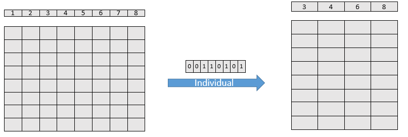
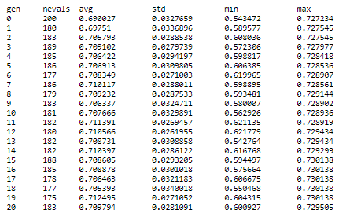

### <font color=black> <font size = 5>Topics to Cover:</font>
<font color=blue> <font size = 3>
> 1. **Setting up baseline solution**
> 2. **Settinup up GA functions:**
    - <font color=green> <font size = 3> **Individual Generating Function** </font></font>
    - <font color=green> <font size = 3> **Crossover Function** </font></font>
    - <font color=green> <font size = 3> **Mutation Function** </font></font>
    - <font color=green> <font size = 3> **Selection Function** </font></font>
    - <font color=green> <font size = 3> **Evaluation Function** </font></font>
> 3. **Setting up the Toolbox**
> 4. **Running the GA**
> 4. **Some ideas to explore**    
</font>


```python
import numpy as np
import pandas as pd
from deap import creator, base, tools, algorithms
from lightgbm import LGBMClassifier
from sklearn.metrics import roc_auc_score
from sklearn.model_selection import StratifiedKFold
from sklearn.preprocessing import LabelEncoder
import random
```


```python
import warnings
warnings.filterwarnings("ignore")
```

### <font color=green> <font size=6>1. Setting up baseline solution</font>

<font color=black> <font size = 4> **Data Source Details:**</font></font>

<font color=black> <font size = 3> **DATA SOURCE:https://www.kaggle.com/c/bnp-paribas-cardif-claims-management/data**</font></font>

<font color=black> <font size = 3> **We filter for the first 52 columns and random 20% rows of the data**</font></font>


```python
df=pd.read_csv('data.csv')
```


```python
cat_cols= df.columns[df.dtypes=='object']
id_col=['ID']
target_col=['target']
use_cols=df.columns[~df.columns.isin(id_col+target_col)]
```


```python
### frequency encoding the cateogircal data
def freq_transformer(val):
        return val.map(val.value_counts(1).to_dict())    
df[cat_cols]=np.column_stack([freq_transformer(df[x]) for x in cat_cols])
```


```python
df.fillna(-1,inplace=True)
```


```python
train=df[use_cols]
y=df[target_col]
```


```python
train.shape
```


    (22864, 50)


```python
folds=StratifiedKFold(n_splits=5,shuffle=True,random_state=100)
model=LGBMClassifier(num_leaves=16,learning_rate=0.1,subsample=0.684,colsample_bytree=0.701,random_state=100,
                     metrics='None',min_child_weight=21)
```


```python
def get_cv_score(model,X,y,folds):
    cv_scores=[]
    for i,(train_index,test_index) in enumerate(folds.split(X,y)):
        tr_df,val_df= X.iloc[train_index], X.iloc[test_index]
        tr_tar,val_tar= y.iloc[train_index], y.iloc[test_index]
        model.fit(X=tr_df, y=tr_tar, eval_set=[(val_df,val_tar)],verbose=100, eval_metric='auc',
              early_stopping_rounds=100)
        cv_scores.append(model.best_score_['valid_0']['auc'])
    return np.mean(cv_scores)

```


```python
base_score=get_cv_score(model,train,y,folds)
```

    Training until validation scores don't improve for 100 rounds.
    [100]	valid_0's auc: 0.718236
    Did not meet early stopping. Best iteration is:
    [39]	valid_0's auc: 0.723268
    Training until validation scores don't improve for 100 rounds.
    [100]	valid_0's auc: 0.72505
    Did not meet early stopping. Best iteration is:
    [49]	valid_0's auc: 0.726088
    Training until validation scores don't improve for 100 rounds.
    [100]	valid_0's auc: 0.722191
    Did not meet early stopping. Best iteration is:
    [74]	valid_0's auc: 0.723293
    Training until validation scores don't improve for 100 rounds.
    [100]	valid_0's auc: 0.729707
    Did not meet early stopping. Best iteration is:
    [59]	valid_0's auc: 0.734481
    Training until validation scores don't improve for 100 rounds.
    [100]	valid_0's auc: 0.723372
    Did not meet early stopping. Best iteration is:
    [32]	valid_0's auc: 0.728887


```python
print ('baseline score is {}'.format(base_score))
```

    baseline score is 0.7272035513531668


### <font color=green> <font size=6>2. Setting up the Toolbox</font>

### <font color=red> <font size=5>Individual Generating Function</font>

<font color=blue> <font size = 3> **How do we generally go about doing feature selection?**</font></font>

<font color=blue> <font size = 3> **We try and subset our dataset using some prior knowledge (maybe based on feature importance) and then check the score on the subsetted data**</font></font>

<font color=blue> <font size = 3> **We will be doing the same thing here, our individual here will be responsible for selection of columns in a dataset**</font></font>

<font color=blue> <font size = 3> **A list of 1s and 0s should be good enough to indicate selection/deselection of a column, look at the picture below to show how a list type individual can be used for selecting features**</font></font>



<font color=blue> <font size = 3> **What are the total number of dataset we can select from the dataset shown above?**</font></font>

- <font color=blue> <font size = 3> **2^8-1**</font></font>

<font color=blue> <font size = 3> **What are the total number of dataset we can select from our dataset?**</font></font>

- <font color=blue> <font size = 3> **2^50-1, this shows how vast the search space is and why we need something like genetic algorithm to find a good solution**</font></font>


<font color=blue> <font size = 3> **The individual is a list of zeros and ones, wee have already seen if we have list as an individual we can use the default one point crossover and flipbit as mutation**</font></font>


```python
### function generating individual
### here len is the total number of columns in the dataset
def gen_ind(len_):
    return [random.randint(0,1) for i in range(len_)]
```


```python
gen_ind(8)
```


    [1, 0, 1, 0, 1, 1, 0, 1]


### <font color=red> <font size=5>Crossover Function</font>

<font color=blue> <font size=4>**Because the individual is a simple list we can use the default one point cross over, we will be using <font color=red>tools.cxOnePoint </font> as the crossover function**</font>

### <font color=red> <font size=5>Mutation Function</font>

<font color=blue> <font size=4>**Because the individual is a simple list we can use the default one point mutation, we will be using <font color=red>tools.mutFlipBit</font> as the mutFlipBit function**</font>

### <font color=red> <font size=5>Evaluation Function</font>

<font color=blue> <font size=4>**We will define the function based on which fitneess will be assigned to an individual, it will take in individual as one of the arguments, also the function should return a tuple**</font>


```python
def eval_func(individual,model,X,y,folds):
    cv_scores=[]
    temp_x=X.iloc[:,np.where(individual)[0]]
#     print(temp_x.shape)
    for i,(train_index,test_index) in enumerate(folds.split(temp_x,y)):
        tr_df,val_df= temp_x.iloc[train_index], temp_x.iloc[test_index]
        tr_tar,val_tar= y.iloc[train_index], y.iloc[test_index]
        model.fit(X=tr_df, y=tr_tar, eval_set=[(val_df,val_tar)],verbose=0, eval_metric='auc',
              early_stopping_rounds=100)
        cv_scores.append(model.best_score_['valid_0']['auc'])
    return (np.mean(cv_scores),)  ## tupple is required

```


```python
### now we will  run this function for different individuals 
### rerun the cell to see different score because each time thee gen_ind function is generating a different individual
eval_func(individual=gen_ind(train.shape[1]),model=model,X=train,y=y,folds=folds)
```


    (0.7073872164704209,)


### <font color=green> <font size=6>3. DEAP code using all the above functions</font>


```python
### creating the classes as discussed in the intro to deap notebook
creator.create("fitness", base.Fitness, weights=(1.0,))
creator.create("Individual", list, fitness=creator.fitness)

### setting up the toolbox
toolbox = base.Toolbox()
toolbox.register("ind", gen_ind, train.shape[1]) ## registering the individual generating function 

#Because the gen_ind function give a list and we want it to be type-casted into Individual type, we use the following snippet
### this function converts individual to list type to the individual type we defined above 
### tools.initIterate helps in typecasting
toolbox.register("individual", tools.initIterate, creator.Individual, toolbox.ind) 

### using this individual function we form the population by using the default repeat function
toolbox.register("population", tools.initRepeat, list, toolbox.individual)

### registering the crossover,mutation,selection and evaluation functions

### we set the element level prob of mutation ass 0.5
toolbox.register('mutate',tools.mutFlipBit,indpb=0.5)
### registering the crossoveer function
toolbox.register('mate',tools.cxOnePoint)
### registering the selection function, tournsize refers to the size of the tournament
toolbox.register('select',tools.selTournament,tournsize=5) 
### registering the evaluation function
toolbox.register('evaluate',eval_func,model=model,X=train,y=y,folds=folds)
```

<font color=blue> <font size=4>**let's experiment with the toolbox and see how the population looks like and other functions**</font>


```python
##defining a pop of 10 individuals
pop=toolbox.population(10)
###let's examine one individual
ind=pop[0]
print (ind)
print (len(ind),np.sum(ind),ind.fitness) ### no fitness value yet
### running the evaluation function on the individual to see how the assignment happens
ind.fitness.values= toolbox.evaluate(ind)
print (len(ind),np.sum(ind),ind.fitness)
```

    [1, 1, 1, 0, 0, 0, 0, 1, 0, 1, 0, 1, 0, 0, 1, 0, 1, 0, 1, 0, 1, 1, 0, 1, 1, 1, 0, 0, 0, 0, 0, 1, 1, 0, 1, 0, 0, 0, 0, 0, 1, 0, 1, 1, 0, 1, 0, 0, 1, 1]
    50 23 ()
    50 23 (0.6979846999057817,)


```python
len(pop)
```


    10


### <font color=green> <font size=6>4. Running the GA</font>


```python
ind.fitness.values
```


    (0.6979846999057817,)


```python
### defining the population
### we will run it for low number of generations, just to show how this evolves
# pop = toolbox.population(n=200)
pop = toolbox.population(n=10)
### we also define a stats function to keep a track of the scores in the GA
stats = tools.Statistics(lambda ind: ind.fitness.values)
stats.register("avg", np.mean)
stats.register("std", np.std)
stats.register("min", np.min)
stats.register("max", np.max)

# pop, log = algorithms.eaSimple(pop, toolbox, cxpb=0.8, mutpb=0.5, ngen=20, stats=stats, verbose=True)
pop, log = algorithms.eaSimple(pop, toolbox, cxpb=0.8, mutpb=0.5, ngen=3, stats=stats, verbose=True)
```

    gen	nevals	avg     	std      	min     	max   
    0  	10    	0.692405	0.0393664	0.606289	0.7272
    1  	10    	0.676348	0.0397169	0.613702	0.7272
    2  	7     	0.713189	0.0183241	0.676116	0.7272
    3  	10    	0.704538	0.0385592	0.611438	0.7272


```python
### we use another function selbest to get the individual with the highest score the latest population
best_ind=tools.selBest(pop,1)[0]
```


```python
best_ind.fitness.values
```


    (0.7271999512560767,)


<font color=red><font size=3>**PFB a snapshot from one of the experiments:**</font></font>


<font color=blue> <font size=4>**Please note that inorder to get good solution we will have to increase the GA size, in the example above we just tried 36 subsets out of the total 2^50-1 and in the picture above we tested somewhere around 4000 subsets. In both the cases we just tried a fraction of the possible solutions. But we can clearly we with just 4000 tries we were able to improve on the base CV score. To improve further you are free to increase the size of the experiment**</font>

### <font color=green> <font size=6>4. Some ideas to explore</font>
- <font color=green> <font size = 3> **early stopping ( will require building your own custom easimple)** </font></font>
- <font color=green> <font size = 3> **adaptive feature selection for faster convergence (use feature importance to govern the individual creation process** </font></font>
- <font color=green> <font size = 3> **Repeated Feature Selection** </font></font>    

